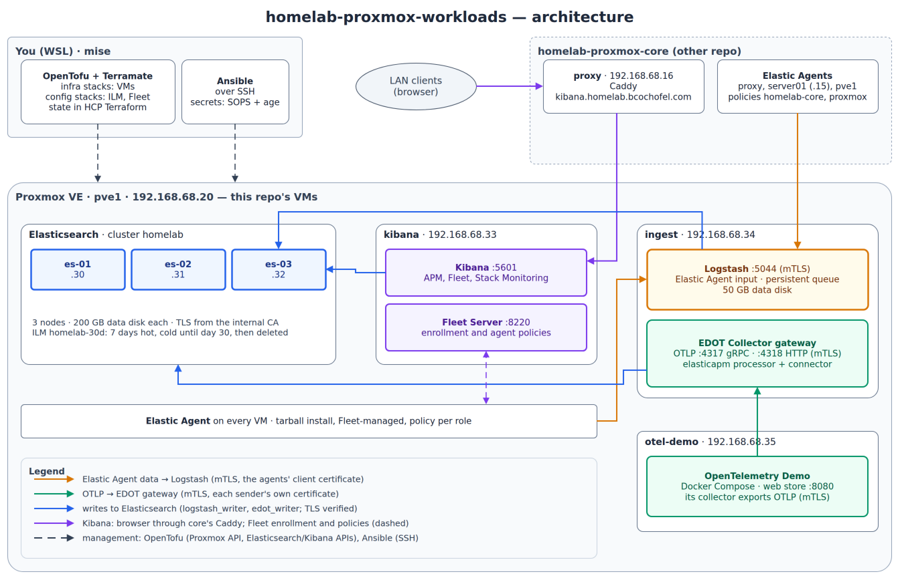

# homelab-proxmox-workloads

The workloads of the homelab, on Proxmox: an Elastic Stack
observability platform (three Elasticsearch nodes, Kibana with Fleet
Server, Logstash and an EDOT Collector gateway) and the OpenTelemetry Demo
as its first instrumented application. Versions are pinned in code, not
here: `elastic_version` in `ansible/inventory/group_vars/all.yml` for the
stack, and each role's defaults for the rest. Built with the same IaC pipeline as
core, split into Terramate stacks:

```text
Packer (template)  ->  OpenTofu + Terramate (VMs, then Elastic config)  ->  Ansible (configure)
```

## Architecture



Editable source: [`docs/diagrams/architecture.drawio`](docs/diagrams/architecture.drawio)
(open in [app.diagrams.net](https://app.diagrams.net)).

This repo is one of two that make up the homelab:

- **[`homelab-proxmox-core`](https://github.com/BCochofelHomelab/homelab-proxmox-core)**
  — edge routing and name resolution: the Caddy reverse proxy (which
  serves Kibana at `https://kibana.homelab.bcochofel.com`) and the CoreDNS
  and Pi-hole DNS pair. Its VMs and the Proxmox host send their telemetry
  here, enrolled from that repo.
- **`homelab-proxmox-workloads`** (this repo) — every workload behind it.
  It replaces the former `homelab-proxmox-elastic` and
  `homelab-proxmox-k3s` repositories.

How data gets in:

- **Elastic Agents** (every VM here, core's VMs and the Proxmox host) are
  managed by Fleet and send everything to **Logstash** over mTLS, which
  writes it to Elasticsearch.
- **OpenTelemetry** senders (the OTel Demo, later your own apps) send
  OTLP to the **EDOT Collector gateway** over mTLS, which writes it to
  Elasticsearch in OTel-native format for Kibana's APM UI. It replaces APM
  Server.
- Everything is kept 30 days: 7 hot, then cold until deleted (ILM policy
  `homelab-30d`).

### Why it's built this way

Both repos follow Google's
[*AI engineering for reliable operations*](https://sre.google/resources/practices-and-processes/ai-engineering-reliable-operations/):
an AI agent helps operate the homelab, only within guardrails that hold
even when it gets something wrong. Core's README
[explains how](https://github.com/BCochofelHomelab/homelab-proxmox-core#why-its-built-this-way);
the same rules apply here:

| Guideline from the paper | How it shows up in this repo |
| --- | --- |
| No ambient access | Nothing is exported into your shell; each `mise run` task decrypts one file for one command ([`docs/CREDENTIALS.md`](docs/CREDENTIALS.md)). |
| Least privilege, one identity per role | Every Elastic component has its own user or key: `logstash_writer` and `edot_writer` can only write data streams, the config stacks have their own API key, the AI agent a read-only one. |
| The agent reads, humans change | The agent's `ai-agent` age key opens only the read-only credentials; it reads Elasticsearch through the Elastic MCP with a key that can't write. |
| Dry-run before any change | Every stack is planned (`mise run tofu:plan`) and reviewed before `mise run tofu:apply`; both stay human steps. |
| Boundaries enforced by construction | The devcontainer holds only the read-only credentials ([`docs/DEVCONTAINER.md`](docs/DEVCONTAINER.md)); `mise run boundary:check` proves it. |

The roadmap, one for both repos, is core's [`docs/SRE-AI.md`](https://github.com/BCochofelHomelab/homelab-proxmox-core/blob/main/docs/SRE-AI.md); home-network and IoT
telemetry still to come is [`TODO-IoT.md`](TODO-IoT.md).

## Quickstart

From an empty Proxmox node to a green Elastic stack with the demo
sending traces. See [Design decisions](#design-decisions) for the
rationale, and [`CONTRIBUTING.md`](CONTRIBUTING.md) to contribute.

### Prerequisites

- **[`homelab-proxmox-core`](https://github.com/BCochofelHomelab/homelab-proxmox-core)
  deployed**: its credential setup is shared with this repo, its DNS
  serves the `homelab.bcochofel.com` names, and its Caddy proxies Kibana.
- A Proxmox VE node with an Ubuntu Server 26.04 ISO uploaded, and the
  addresses `192.168.68.30`–`.39` free.
- Credentials as described in [`docs/CREDENTIALS.md`](docs/CREDENTIALS.md):
  core's Proxmox identities and secret files, plus this repo's HCP
  Terraform workspaces. The Elasticsearch API key for the config stacks
  comes later, in step 5.
- About 38 GB of RAM and 950 GB of disk for the VMs ([Topology](#topology)).

### Credentials

Nothing is ever exported into your shell: each `mise run` task decrypts
one file with `sops exec-env` and passes it to one command. Proxmox, HCP
and Elasticsearch credentials live in `~/.secrets/` (shared with core);
the Elastic stack's own passwords and the internal CA's keys are
SOPS-encrypted files in this repo, encrypted to your age key only and
committed. The AI agent only ever uses the read-only `ai-agent` key.
Full procedure: [`docs/CREDENTIALS.md`](docs/CREDENTIALS.md).

### 0. Prepare the local environment

Needs [mise](https://mise.jdx.dev), activated in your shell; everything
else is pinned in `mise.toml`.

```bash
mise trust && mise install
mise run doctor           # must end with "No problems found"
```

Installs every pinned tool, creates the `.venv/` Ansible runs from, and
installs the git hooks ([`docs/TOOLCHAIN.md`](docs/TOOLCHAIN.md)). Then
check the credentials before changing anything:

```bash
mise run secrets:check    # each secret file opens with the right key only
mise run creds:check      # each credential authenticates
mise run boundary:check   # the AI agent's boundary holds
```

Every line must be `ok`. On a first build, `creds:check` reports the
Elasticsearch checks as failed until step 5 (there's no cluster yet).

### 1. Build the VM template (Packer)

```bash
cd packer/ubuntu-26.04
cp variables.pkrvars.hcl.example variables.auto.pkrvars.hcl   # fill in, gitignored, auto-loaded
mise run packer:build
```

`ubuntu-26.04-workloads` (VM 9001): Ubuntu with Elastic Agent installed
but not enrolled, and no Docker. See
[`packer/ubuntu-26.04/README.md`](packer/ubuntu-26.04/README.md).

### 2. Create the internal CA (once)

Every Elastic component speaks TLS with certificates from one internal CA,
and every agent presents one client certificate to Logstash:

```bash
mise run pki:init           # ansible/pki/elastic-ca.crt + elastic-ca.key.sops
mise run pki:agent-client   # ansible/pki/agent-client.crt + agent-client.key.sops
```

Commit the four files: the keys are encrypted to your age key, and
neither is ever written to disk in clear. See
[`docs/ANSIBLE.md`](docs/ANSIBLE.md#internal-ca).

### 3. Generate the stack's passwords

`ansible/inventory/group_vars/all.sops.yaml` holds the Elastic stack's
passwords (`elastic`, `kibana_system`, Kibana's encryption key,
`logstash_writer`, `remote_monitoring_user`, `edot_writer`). Each is
generated with `openssl rand` and never shown: the commands are in
[`docs/ANSIBLE.md`](docs/ANSIBLE.md#secrets). Commit the file.

### 4. Create the VMs (OpenTofu `infra` stacks)

```bash
mise run tofu:init     # every infra stack, one time
mise run tofu:plan     # review: saves <stack>/tfplan
mise run tofu:apply    # applies those saved plans
```

Clones the template into the Elastic and OTel Demo VMs and writes the
Ansible inventory (`ansible/inventory/*.ini`). See
[`docs/TERRAFORM.md`](docs/TERRAFORM.md).

### 5. Install the stack, then configure it

The first Ansible run installs Elasticsearch, Kibana, Logstash and the
EDOT gateway. On a fresh build it then **stops at Fleet Server**, asking
for the Fleet config stack: that's expected.

```bash
mise run ansible:site
```

Kibana is now up. Create the config stacks' API key in it
([`docs/CREDENTIALS.md`](docs/CREDENTIALS.md#elasticsearch-api-key-config-stacks)),
then apply the **config** stacks: ILM and Fleet (outputs, Fleet Server,
the agent policies and their integrations):

```bash
mise run tofu:init -- --tags config
mise run tofu:plan -- --tags config
mise run tofu:apply -- --tags config
```

### 6. Finish the configuration (Ansible)

```bash
mise run ansible:site
```

This run enrolls Fleet Server and every VM's Elastic Agent, installs
Docker and the OTel Demo, and ends with a health check:

- the cluster is green on every node;
- Kibana answers, directly and through core's Caddy;
- Logstash and the EDOT gateway accept clients with a CA-signed
  certificate and refuse those without one;
- the demo's traces reach Elasticsearch;
- every agent is online in Fleet.

A second run should report `changed=0`. See
[`docs/ANSIBLE.md`](docs/ANSIBLE.md).

To bring core's VMs and the Proxmox host in, enroll them from core
([its `docs/ANSIBLE.md`](https://github.com/BCochofelHomelab/homelab-proxmox-core/blob/main/docs/ANSIBLE.md#elastic-agent)),
with the enrollment tokens of the **Homelab core** and **Proxmox**
policies.

## Verify

- **Kibana:** <https://kibana.homelab.bcochofel.com>, as `elastic` (the
  password from `all.sops.yaml`).
  - *Fleet → Agents*: every agent Healthy, each on its role's policy.
  - *Observability → APM → Service inventory*: the demo's services, with
    traces and a service map.
  - *Stack Monitoring*: Elasticsearch, Kibana and Logstash.
- **The demo's web store:** <http://192.168.68.35:8080/>. Its load
  generator places orders around the clock.
- **The playbook's health check** (step 6) passes; a second run is
  `changed=0`.

## Topology

| VM | vCPU | RAM | Disk (OS + data) | Runs | IP |
| --- | --- | --- | --- | --- | --- |
| `es-01`, `es-02`, `es-03` | 2 | 8 GB | 50 + 200 GB | Elasticsearch | `.30`, `.31`, `.32` |
| `kibana` | 2 | 4 GB | 50 GB | Kibana, Fleet Server | `.33` |
| `ingest` | 2 | 4 GB | 50 + 50 GB | Logstash, EDOT Collector gateway | `.34` |
| `otel-demo` | 2 | 6 GB | 50 GB | OpenTelemetry Demo (Docker Compose) | `.35` |

All in `192.168.68.0/22`. `.30`–`.39` is reserved for this repo.

| Port | On | For |
| --- | --- | --- |
| `9200` | `es-*` | Elasticsearch (TLS) |
| `5601` | `kibana` | Kibana (TLS); proxied by core's Caddy |
| `8220` | `kibana` | Fleet Server (TLS) |
| `5044` | `ingest` | Logstash, Elastic Agent input (mTLS) |
| `4317`, `4318` | `ingest` | EDOT gateway, OTLP gRPC and HTTP (mTLS) |
| `8080` | `otel-demo` | The demo's web store |

## Design decisions

- **Stacks with separate lifecycles.** Terramate splits OpenTofu into
  `infra` stacks (the VMs, which rarely change) and `config` stacks
  (Elasticsearch and Fleet configuration, which change often), each with
  its own HCP Terraform workspace and state.
- **DEB packages for the stack, tarball for the agents.** Elasticsearch,
  Kibana and Logstash come from Elastic's signed APT repository, pinned and
  held at `elastic_version`. Elastic Agent and the EDOT Collector come from
  Elastic's signed tarball, so Fleet can upgrade the agents.
- **One internal CA.** Every node's key is generated on the node and never
  leaves it; only its CSR is signed on your machine. Logstash and the EDOT
  gateway require client certificates (mTLS).
- **Logstash for agents, the EDOT gateway for OTLP.** Logstash has no OTLP
  input, and Kibana's APM UI needs the gateway's `elasticapm` processor and
  connector. Logstash pipelines are files deployed by Ansible:
  centrally managed pipelines are a paid feature.
- **Basic license.** Everything here works without a trial or
  subscription.
- **One retention policy.** `homelab-30d` applies to every `logs-*`,
  `metrics-*` and `traces-*` data stream through their `@custom`
  component templates.
- **No Docker in the template.** Only the OTel Demo VM gets Docker, from
  Ansible. It also gets IPv6 back in its kernel: some demo containers
  listen on `[::]`.
- **Decoupling.** OpenTofu and Ansible run as separate, explicit commands:
  no `local-exec` chaining.

## Documentation

- [`docs/CREDENTIALS.md`](docs/CREDENTIALS.md) — what's shared with core,
  this repo's HCP workspaces, the Elasticsearch API keys and the secret
  files.
- [`docs/PACKER.md`](docs/PACKER.md) — the VM template.
- [`docs/TERRAFORM.md`](docs/TERRAFORM.md) — the OpenTofu stacks,
  Terramate, the ILM and Fleet configuration.
- [`docs/ANSIBLE.md`](docs/ANSIBLE.md) — roles, playbooks, secrets, the
  internal CA, and each service.
- [`docs/DEVCONTAINER.md`](docs/DEVCONTAINER.md) — the devcontainer the AI
  agent runs in, with only the read-only credentials.
- [`docs/TOOLCHAIN.md`](docs/TOOLCHAIN.md) — every tool, why it's here,
  where it's pinned and how to bump it.
- [`CONTRIBUTING.md`](CONTRIBUTING.md) — environment setup, branching,
  commit conventions and versioning.
- [`docs/SRE-AI.md`](https://github.com/BCochofelHomelab/homelab-proxmox-core/blob/main/docs/SRE-AI.md) (in core) — the homelab-wide SRE AI-autonomy
  roadmap and where it stands, with checkboxes, for both repos.
- [`TODO-IoT.md`](TODO-IoT.md) — home-network and IoT telemetry.

## References

- [Elastic Stack documentation](https://www.elastic.co/docs)
- [Fleet and Elastic Agent](https://www.elastic.co/docs/reference/fleet)
- [EDOT Collector](https://www.elastic.co/docs/reference/edot-collector)
- [OpenTelemetry Demo](https://opentelemetry.io/docs/demo/)
- [Terramate](https://terramate.io/docs/) and
  [OpenTofu](https://opentofu.org/docs/)
- [Proxmox VE documentation](https://pve.proxmox.com/pve-docs/)
- [Conventional Commits](https://www.conventionalcommits.org/) and
  [Semantic Versioning](https://semver.org/) — commit messages and
  releases (see [`CONTRIBUTING.md`](CONTRIBUTING.md))
